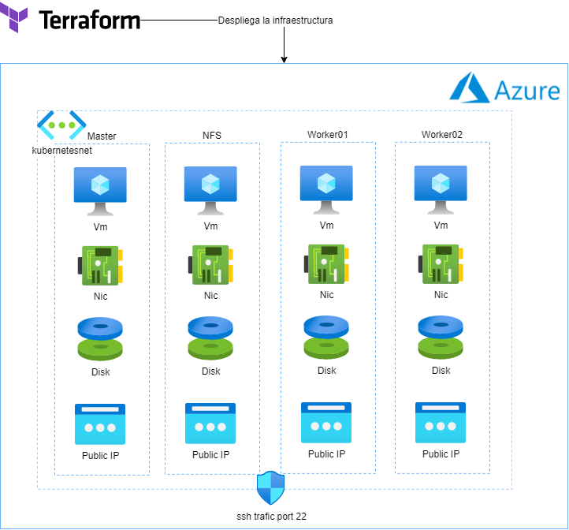

# Resolución caso práctico 2 UNIR EU DevOps y Cloud

El siguiente documento describe como realizar el despliegue con Terraform y Ansible, se tienen que seguir los siguientes pasos uno a uno

### Clonar repositorio
```console
> git clone https://github.com/fabio97U/cp2_unir.git
> cd cp2_unir
```

## Configuración con Terraform
Version de terraform y provider utilizada
- Terraform v1.1.7 on windows_amd64
- azurerm 2.99.0

### Para levantar la infraestructura en azure correr el comando
- Remplazar los archivos "correccion-vars.tf" y "credentials.tf" con los archivos personales con el acceso al provider

```console
> cd terraform
> terraform init
> terraform plan
> terraform apply
```
Diagrama de la infraestructura que se levantara con terraform



## Configuración con Ansible

Estas son las configuraciones previas para lanzar "./deploy.sh",
conectarse por ssh a las ips publicas dadas por azure con el usuario "ssh_user" y "public_key_path" configurado en el archivo de terraform "correccion-vars.tf", es necesario configurar las direcciones IPS públicas en los siguientes archivos

- ansible/hosts.azure
- ansible/group_vars/all.yaml
- ansible/roles/crear-nfs/templates/exports.j2

Realizar lo siguiente en el nodo master
```console
[adminUsername@vm-master ~]$ sudo su
[root@vm-master adminUsername]# dnf install epel-release -y
[root@vm-master adminUsername]# dnf install ansible git tree jq -y
[root@vm-master adminUsername]# ansible-galaxy collection install ansible.posix
[root@vm-master adminUsername]# ansible-galaxy collection install community.general
```

Realizar lo siguiente en los nodos sobre los cuales Ansible realizara configuraciones
```console
> dnf install python36 -y
```

En el nodo master 
Copiar y pegar los pares de clave generados (de preferencia los mismo con los se desplego terraform) en:
- /home/adminUsername/.ssh/

Clonando el repositorio en el master
```console
> cd /home/adminUsername/
> git clone https://github.com/fabio97U/cp2_unir.git
> chmod 777 cp2_unir/ansible/deploy.sh
> cd cp2_unir/ansible/
> ansible -i hosts.azure -m ping all
> ./deploy.sh
```

Una vez termine el despliegue, podemos validar el despliegue de la simple aplicación con un curl
```console
> curl localhost:8001/api/v1/namespaces/kubernetes-dashboard/services
```

Diagrama de la aplicación a levantar con ansible es el siguiente:


#### Link demostración
En el siguiente video se muestra todo el proceso de despliegue descrito en los pasos anteriores
[Demostración](https://youtu.be/iQag6f1xOw8)
, los siguientes minutos se pueden saltar
- 00:45-03:50, se realiza el terraform apply
- 10:40-17:20, se realiza el ./deploy.sh

#### Borrar repositorio
```console
> cd /home/adminUsername/
> rm -rf /home/adminUsername/cp2_unir
```

#### Destruir infraestructura
```console
> cd terraform
> terraform destroy
```
